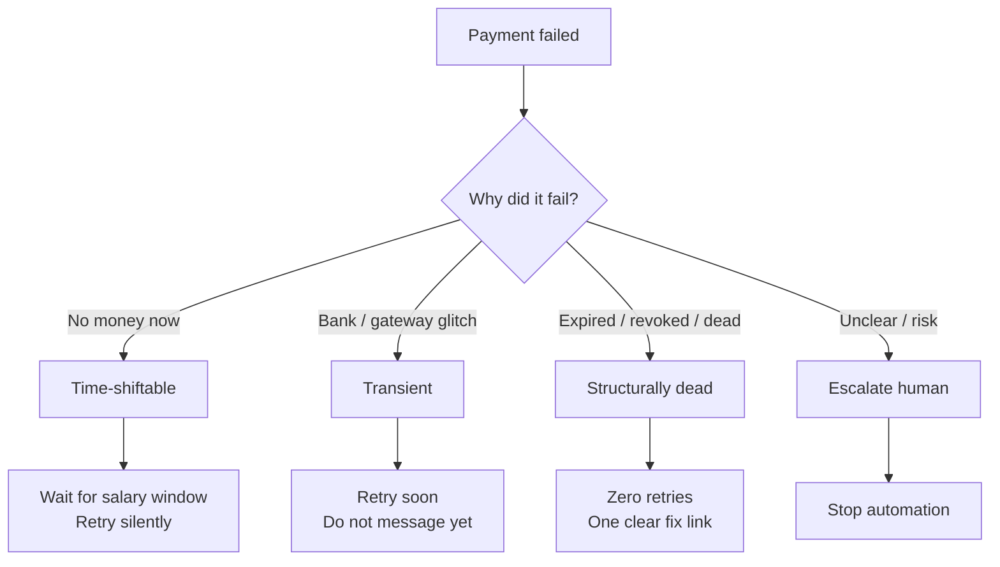
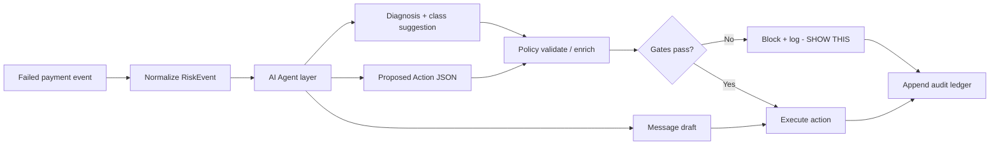
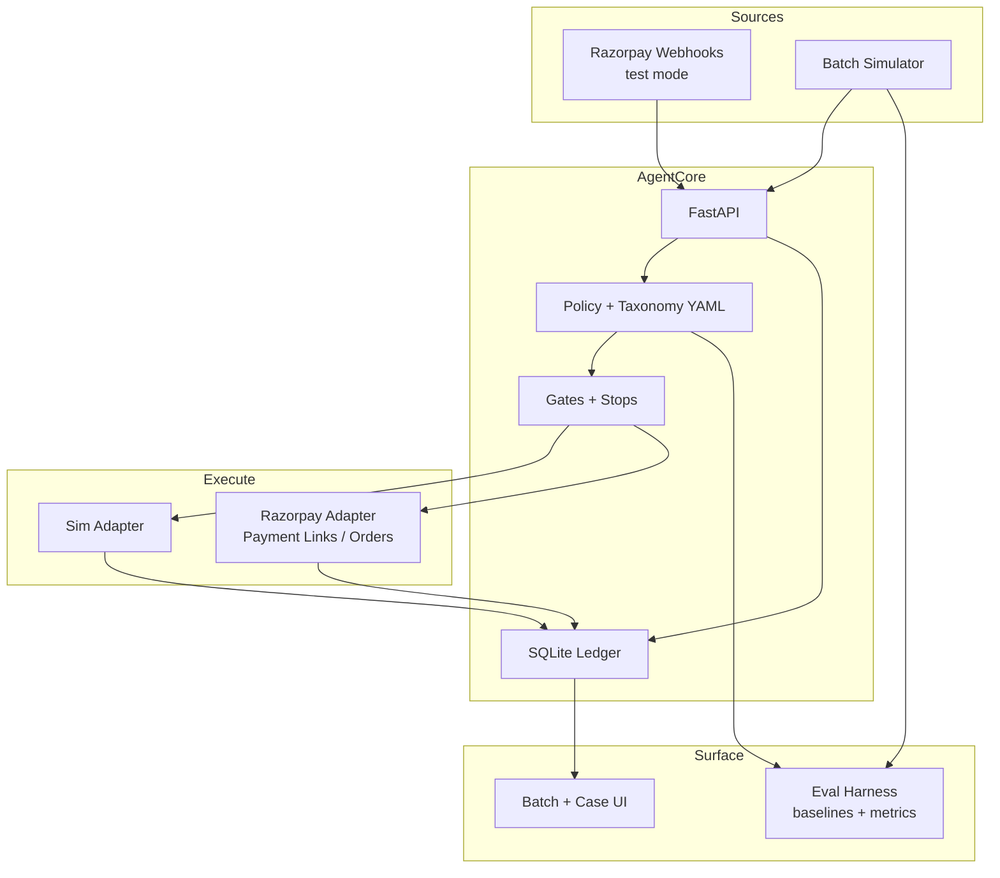
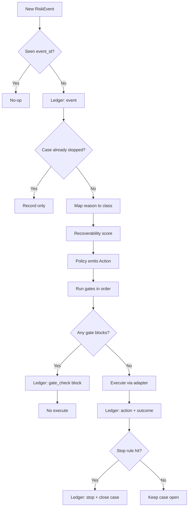
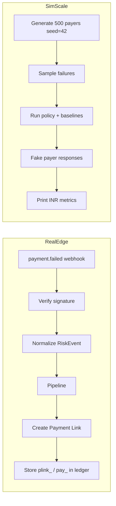
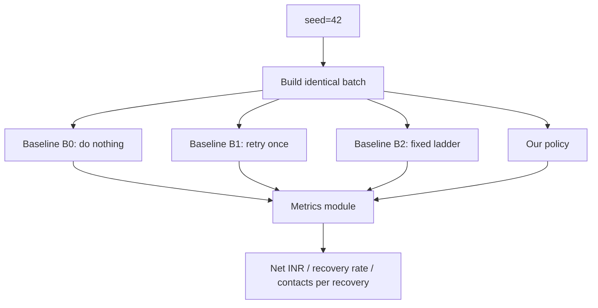
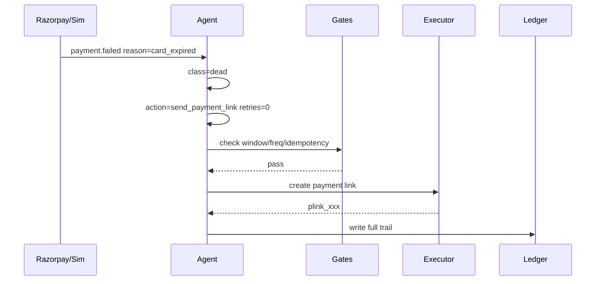
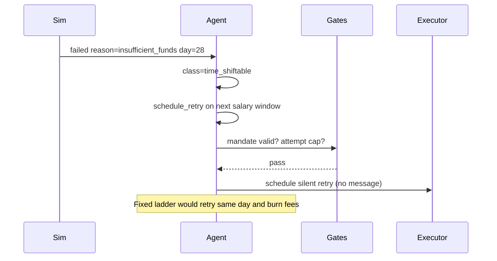
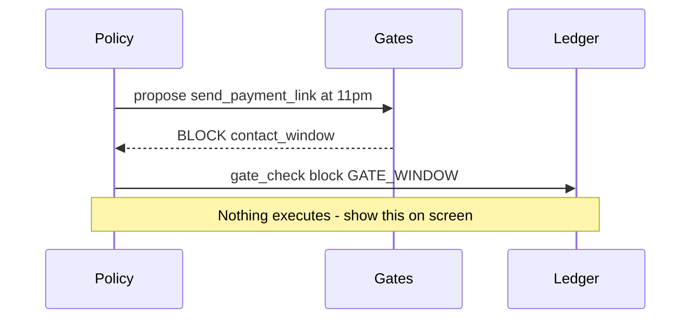

# Razorpay /buildathon - Recovery Agent
## Implementation Plan (Idea-First + Technical)

**Track:** 03 - AI Revenue Recovery  
**Builder:** Solo + Cursor  
**Calendar:** 15 days | MVP by Day 7 | Days 8-15 = proof + submission  
**Source of truth:** this file

---

# PART A - THE IDEA (read this first)

## A1. What we are building (one idea)

**Name (working):** Recovery Agent  

**Idea in plain words:**  
When a subscription payment fails, most systems treat every failure the same: retry 3 times, send a generic message. That is wrong.

- If the card is **expired**, retrying is useless - you need one clear "update card / pay link".
- If the account has **no money today**, waiting until salary week is smarter than spamming.
- If the bank had a **glitch**, retry soon and stay quiet.

So we build an agent that:

1. **Detects** a failed payment  
2. **Understands why** (failure class)  
3. **Chooses one safe action** from a short allowed list  
4. **Checks rules** that can say NO  
5. **Executes** (simulate at scale, real Razorpay test mode at the edges)  
6. **Writes a diary** of every step (audit trail)  
7. **Proves** it recovered more money than a dumb retry plan on a batch of 500+

**Pitch line:**  
> Same failed payment. Different reason. Different next step. Measured in rupees.

## A2. Why this idea fits the hackathon

| Judge wants | How our idea answers |
|---|---|
| Detect -> intervene -> execute | Full loop, not a dashboard of alerts |
| Measured money across a batch | Simulator + baselines B0-B2 |
| Compliant escalation + stopping rules + audit | Gates, stops, ledger |
| AI judgment | AI does heavy reasoning + proposes actions; policy/gates bound what can execute; we measure AI impact |
| Problem taste | One lane: involuntary churn / failed recurring |

## A3. The core insight (your moat)



**Wrong move people make today:** one ladder for all classes.  
**Our move:** class decides the playbook.

## A4. AI has a significant role (this is an AI hackathon)

This is **not** "rules with a chatbot sticker." The AI agent is a core part of the product.

### What the AI owns (must ship)

| AI job | Why it matters in an AI track |
|---|---|
| **Diagnose** the failure in natural language | Shows reasoning, not just a code lookup |
| **Classify** ambiguous / messy decline text into our taxonomy | Real gateway text is messy; this is where models shine |
| **Propose** the next intervention from the closed verb set | Structured output = agentic behavior judges can see |
| **Write** the payer message (cause-specific, clear) | Personalization / language quality |
| **Explain** the case trail for ops ("why we did this") | Demo + audit readability |
| **Summarize** a batch run | Ops narrative for the video |

### What AI must NOT own alone

| Forbidden without gates | Why |
|---|---|
| Execute debits / retries with no policy check | Payments risk; fails trust |
| Invent new action verbs outside the closed set | Unbounded agent trap |
| Bypass stops / contact windows | Compliance story dies |

### Pattern: AI proposes, policy disposes



**Pitch line for AI judgment:**  
> The model does the thinking. The policy layer does the bounding. That is how you ship agents on payment rails.

Taxonomy YAML is still required: it is the **contract** the AI must propose inside, and the fallback when the model is unsure.

## A5. What "good" looks like in the demo

1. Open with a **number**: we beat fixed ladder on 500 cases  
2. Show the **idea**: expired card vs empty account  
3. Show **AI reasoning** on a case (diagnosis + proposed action JSON)  
4. Show a **refusal**: AI proposed something, gate said no  
5. Show one **full trail** from the ledger (including AI actor rows)  
6. Show one **real** Razorpay test ID next to our ledger  
7. Ablation: with AI vs rules-only (prove AI earned its place)  
8. Say honestly what was simulated

---

# PART B - PRODUCT SCOPE

## B1. Build this

| In scope | Why |
|---|---|
| Failed subscription / recurring debits | Clear money per event |
| Cards + UPI Autopay + e-NACH in the *story* | Indian rails |
| Batch simulator n >= 500 | Measured money |
| Thin Razorpay test-mode (webhooks + payment links) | Real rails at edges |

## B2. Cut this

- Checkout abandonment as main product  
- Voice / Hinglish voice  
- B2B invoice chasing  
- Dispute / refund bots  
- Multi-agent frameworks, Temporal, K8s  
- Unbounded "LLM can do anything" loops with no closed action set  

### AI is in scope (required)

- AI diagnosis + structured action proposal on every case path used in demo  
- AI message generation for contact verbs  
- Ablation proving AI contribution (or honest "rules won INR, AI won explainability")  

## B3. Closed action set (MVP)

| Verb | Meaning | Money moves? |
|---|---|---|
| `schedule_retry` | Try again at time T | Later (simulated or test charge) |
| `send_payment_link` | One fix / pay link | Customer pays via link |
| `request_mandate_update` | Ask to re-link mandate/card | No immediate debit |
| `escalate_human` | Hand off | No |

Optional stub only if easy: `switch_rail`.  
Cut: voice, partial collect.

## B4. Gates (can block) - ship 5

1. Contact window  
2. Frequency cap  
3. Mandate validity  
4. Attempt cap  
5. Idempotency  

## B5. Stops (case ends) - ship 5

1. Recovered  
2. Mandate revoked  
3. Attempt cap reached  
4. Opt-out  
5. Human override  

---

# PART C - TECHNICAL DESIGN

## C1. System context



## C2. Stack (boring on purpose)

| Layer | Choice | Why |
|---|---|---|
| API | Python + FastAPI | Fast, clear, Pydantic schemas |
| DB | SQLite | Solo-friendly; enough for demo |
| Policy | `taxonomy.yaml` | Diffable; show on stage |
| Jobs | In-process scheduler | No Temporal this week |
| LLM | **Required** - one provider, structured outputs | Diagnosis, classify assist, propose Action, messages, summaries |
| UI | Simple React or HTML | Two screens only |
| Tunnel | ngrok | Webhooks to laptop |

## C3. Repo layout

```text
recovery-agent/
  ingest/
  diagnose/
  ai/              # agent.py prompts.py schemas.py client.py  ***REQUIRED***
  policy/
  guard/
  execute/
  ledger/
  eval/
  api/
  ui/
  fixtures/
  tests/
  docs/
  README.md
  .env.example
```

## C4. Data model (technical)

### RiskEvent (one shape for webhook + simulator)

```text
RiskEvent
  event_id          str      # idempotency key
  source            enum     # razorpay_webhook | simulator
  occurred_at       datetime
  merchant_id       str
  payer_ref         str      # pseudonymous, not raw PII
  subscription_id   str|null
  mandate_id        str|null
  payment_ref       str|null # pay_xxx on real path
  amount_paise      int
  currency          str      # INR
  rail              enum     # card | upi_autopay | enach
  raw_error_code    str
  raw_error_reason  str
  attempt_number    int
  mandate_state     enum|null
  mandate_cap_paise int|null
  payer_context     object   # tenure, prior_failures, credit_day, language, dnd_flag
```

### Case (mutable status - solo shortcut)

```text
Case
  case_id
  status            open | blocked | stopped | recovered
  failure_class
  recoverability    float 0..1
  attempts_used
  contacts_used
  stop_reason       null|str
  last_action
  created_at / updated_at
```

### LedgerEntry (append-only audit)

```text
LedgerEntry
  seq               int
  case_id
  at
  kind              event | classification | decision | gate_check | action | outcome | stop
  actor             system | policy | llm | human
  policy_version    str
  payload           json
  reason_code       str
  gate_name         str|null
  gate_result       pass | block | null
```

## C5. Taxonomy (idea encoded as data)

Store in `policy/taxonomy.yaml`. You own this file (not Cursor).

Example shape:

```yaml
version: "2026-08-21"
classes:
  insufficient_funds:
    category: time_shiftable
    action: schedule_retry
    contact: false
    timing: salary_window   # 1st-7th or observed credit day
  issuer_transient:
    category: transient
    action: schedule_retry
    contact: false
    timing: short_backoff   # 30-90 min
  gateway_timeout:
    category: transient
    action: reconcile_then_retry
    contact: false
  card_expired:
    category: dead
    action: send_payment_link
    contact: true
    retries: 0
  mandate_revoked:
    category: dead
    action: request_mandate_update
    contact: true
    retries: 0
  risk_fraud:
    category: stop
    action: escalate_human
    contact: false
```

Map Razorpay `error.reason` values into these classes in `fixtures/decline_codes.json`.

## C6. Decision flow (detailed)



## C7. Recoverability score (simple, explainable)

```text
score =
  base_by_class
  + value_weight          # higher amount => more effort allowed
  + timing_proximity      # closer to salary day => higher for NSF
  + payer_history_bonus
  - fatigue_penalty       # each prior contact lowers score
```

Use score only to **cap effort** (max attempts / whether contact allowed). Keep it deterministic.

## C8. Timing model

| Class | Timing rule |
|---|---|
| insufficient_funds | Prefer calendar days 1-7 or payer.observed_credit_day |
| transient | Retry in 30-90 minutes |
| dead | No retry; contact once if allowed |
| risk | No auto retry |

## C9. Real Razorpay path vs sim path



| Real (test mode) | Simulated |
|---|---|
| Orders, payments, payment links | Payer response / fatigue |
| Signed webhooks | Batch n=500 |
| IDs in ledger | Mandate notice clocks, DND/DLT |

**Say in video:** Simulated at scale, real at the edges.

## C10. Eval harness (how you prove the idea)



Baselines:
- **B0** natural recovery  
- **B1** immediate single retry  
- **B2** 3 fixed retries + generic nag (main rival)  
- **B3** optional aggressive  

Metrics (minimum):
1. Net INR vs best baseline  
2. Recovery rate  
3. Contacts per recovery  
4. Stop violations (= 0)  
5. Gate blocks (> 0)

Command target:

```text
python -m eval.harness --policy ours --seed 42 --n 500
python -m eval.harness --baseline b2 --seed 42 --n 500
```

## C11. API sketch (FastAPI)

| Method | Path | Purpose |
|---|---|---|
| POST | `/webhooks/razorpay` | Receive + verify + enqueue |
| POST | `/sim/run` | Run batch with seed |
| GET | `/batch/{run_id}` | Metrics + counters for UI |
| GET | `/cases/{case_id}` | Full ledger trail |
| POST | `/demo/replay` | Offline replay without network |

## C12. UI (two screens only)

1. **Batch view** - our policy vs B2, live counters, gate-block count  
2. **Case view** - timeline from ledger (event -> class -> decision -> gates -> action -> outcome)

## C13. Security / compliance basics

- Keys only in `.env` (never git)  
- Webhook signature verification from day 1  
- No raw card data; tokens / refs only  
- No payer PII in LLM prompts  
- Test mode only in demo  

---

# PART D - EXAMPLE WALKTHROUGHS

## D1. Expired card (dead)



## D2. Insufficient funds (time-shift)



## D3. Gate refusal (best demo beat)



---

# PART E - 15-DAY IMPLEMENTATION SCHEDULE

## Days 1-2 - Scoreboard + webhook

**Idea focus:** can we measure money at all?

- [ ] Repo skeleton + `.env.example`  
- [ ] RiskEvent schema + SQLite models  
- [ ] Simulator v1 + B0-B2 baselines  
- [ ] `docs/METHODOLOGY.md` metric definitions  
- [ ] One signed Razorpay webhook  
- [ ] Start `taxonomy.yaml`  

**Exit:** harness prints INR for seed 42; webhook verified.

## Days 3-4 - Moat + AI agent core

**Idea focus:** taxonomy + **significant AI** (diagnose, propose, message)

- [ ] Classifier + policy engine (rules = fallback + validator)  
- [ ] Scoring + salary timing  
- [ ] **AI module required:** diagnosis, structured Action proposal, message draft  
- [ ] Wire: AI propose -> policy validate -> (gates next)  
- [ ] Beat B2 on INR and contacts/recovery  
- [ ] Real slice: fail -> AI diagnose/propose -> Payment Link -> ID in ledger  

**Exit:** demo shows AI reasoning JSON; fallback works if LLM is down; seed still reproducible for eval.

## Days 5-6 - Restraint

**Idea focus:** visible safety while AI stays on screen

- [ ] 5 gates + 5 stops  
- [ ] Case trail UI: AI diagnosis + proposal + gate results  
- [ ] Adversarial tests (post-stop events do nothing)  
- [ ] Batch UI side-by-side  
- [ ] Hero case: AI proposed, gate blocked  

**Exit:** stop violations 0; gate blocks > 0; AI rows in ledger.

## Day 7 - FREEZE

- [ ] n>=500 full run saved  
- [ ] Bugs only  
- [ ] No new features after Day 7  

## Days 8-10 - Believability

- [ ] Ablation: AI+policy vs rules-only vs fixed ladder  
- [ ] Keep AI for diagnosis/messages even if INR delta is small - say so honestly  
- [ ] ARCHITECTURE + COMPLIANCE short docs  
- [ ] Harden idempotency / timeout reconcile  

## Days 11-13 - Submission

- [ ] 5-min video + backup  
- [ ] "What broke, and how you got out"  
- [ ] Public GitHub tidy  

## Days 14-15 - Rehearse

- [ ] Time to 5:00  
- [ ] Q&A drill  
- [ ] Sleep  

---

# PART F - DEMO + Q&A + RISKS

## F1. 5-minute demo script

| Time | Beat | Show |
|---|---|---|
| 0:00-0:25 | Result | Beat B2 on 500 cases |
| 0:25-1:05 | Idea | Three failure categories |
| 1:05-1:50 | AI brain | Diagnosis + proposed Action JSON |
| 1:50-2:40 | Batch | Side-by-side counters |
| 2:40-3:20 | Refusal | AI proposed, gate blocked |
| 3:20-3:55 | Trail | Ledger including actor=llm |
| 3:55-4:25 | Real edge | Matching Razorpay test ID |
| 4:25-5:00 | Honesty | Assumptions + ablation (what AI added) |

## F2. Short Q&A

| Question | Answer |
|---|---|
| Simulated number? | Trust ranking + same seed + stated assumptions |
| Spam? | Fatigue + frequency gate + contacts/recovery |
| Does AI move money alone? | No - AI proposes; policy/gates must pass before execute |
| Why not unbounded AI agent? | Payments need bounds; closed verbs + audit is the product |
| What did AI add? | Ablation: diagnosis, ambiguous class, messages, +/- INR |
| What broke? | Your real build failure story |

## F3. Solo + Cursor rules

- Cursor writes scaffolding  
- You own taxonomy, assumptions, cuts, video script  
- Daily test: "Does one command print INR vs B2?"  
- Ban: voice, multi-agent, Temporal, second lane  

## F4. Risks

| Risk | Mitigation |
|---|---|
| Overbuilding | Day-7 freeze |
| Simulator cheating | Publish assumptions + ablation |
| Weak sandbox | Verify early; simulate and say so |
| Webhook pain | Day 1; backup video |
| No submission story | Journal breaks daily |

---

# PART G - P0 DONE CHECKLIST

- [ ] AI diagnosis + structured Action proposal on demo path  
- [ ] Ledger rows with actor=llm for AI steps  
- [ ] Ablation table includes AI on vs rules-only  
- [ ] Same RiskEvent from sim and webhook  
- [ ] Taxonomy maps fixture reasons -> classes  
- [ ] Only closed verbs emitted  
- [ ] Gates block + log  
- [ ] Stops are terminal  
- [ ] Case trail in UI  
- [ ] Batch >=500 vs B0-B2  
- [ ] Real Payment Link + verified webhook + matching ID  
- [ ] No secrets in git  
- [ ] Reproducible harness command  
- [ ] 5-min video  
- [ ] Real "what broke" writeup  

---

# PART H - FIRST CODE STEPS (when you start Day 1)

1. Create `recovery-agent/` folders from C3  
2. Implement `RiskEvent` + SQLite  
3. Implement `eval.harness` printing B2 INR for seed 42  
4. Implement webhook signature verify hello-world  
5. Draft first 8 rows of `taxonomy.yaml` by hand  

---

Plan version: idea-first + **AI-significant** + bounded policy | solo + Cursor | Track 03 | 7-day MVP / 15-day submission
