# BUILD_TECH.md
## Technical Implementation Guide (Senior -> Intern)

**Audience:** You (intern builder), solo, with Cursor as pair programmer  
**Companion doc:** `BUILD_PLAN.md` = product idea + schedule. **This doc** = how to actually build it, phase by phase.  
**Tone:** I am your senior. I will tell you what to build, why that tool, what to avoid, and how data moves. Follow the phases in order.

---

# 0. How to use this guide

1. Do **not** start Day 1 with the LLM. Build scoreboard + schemas first.  
2. By **Days 3-4**, AI is **required and significant** (diagnose, propose, message) - this is an AI hackathon.  
3. Finish each phase's **Exit check** before the next.  
4. When stuck, ask Cursor for code - but you must understand the flow in this file first.  
5. Daily question: *Can I point to which layer owns this bug?*

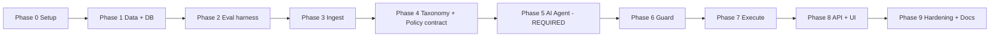

---

# 1. Architecture you are building

Think of the system as a **pipeline**. An event enters at the top. Each layer does one job. No layer reaches upward.

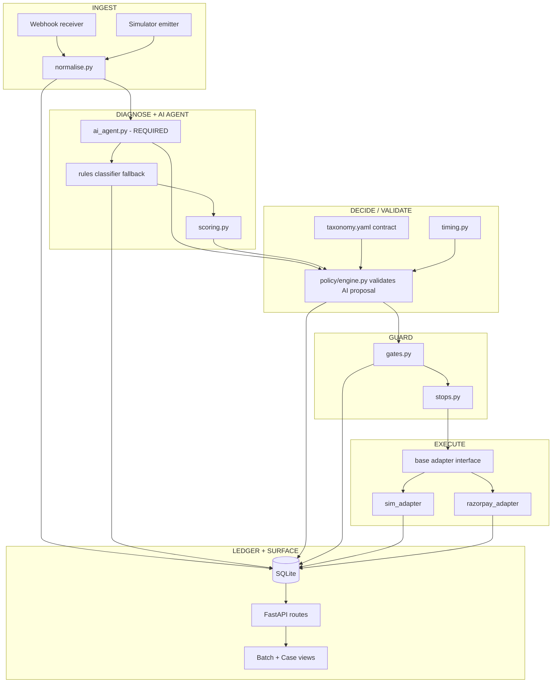

**Senior rule:** AI does significant reasoning in `ai_agent.py`. Policy/guard still own what is allowed to execute. Do not hide business logic in the UI.

---

# 2. Framework and library choices (and why)

| Piece | We use | Why (teachable reason) | We do NOT use | Why not |
|---|---|---|---|---|
| Language | **Python 3.11+** | Fast to write, great for data + HTTP, Cursor is strong at it | Node-only stack | Fine too, but one language for API+eval is simpler solo |
| Web API | **FastAPI** | Auto docs, async webhooks, type hints via Pydantic | Flask/Django | Flask is thinner but more boilerplate; Django is heavy for a 7-day agent |
| Validation | **Pydantic v2** | RiskEvent must be strict; bad JSON fails loud | Hand-rolled dict checks | You will miss fields under stress |
| DB | **SQLite** via SQLAlchemy or raw aiosqlite | Zero ops, file-based, enough for demo | Postgres/Redis cluster | Extra moving parts, no judge points |
| Migrations (optional) | **Alembic** or create_all on boot | Solo: create_all is OK for hackathon | Fancy migration drama | Not needed week 1 |
| HTTP client | **httpx** | Talk to Razorpay REST cleanly | `requests` only | httpx supports async if you need it |
| Razorpay | **REST + official patterns** (Basic auth key:secret) | Payment Links, Orders, webhook signatures | Unofficial SDKs you do not understand | Debug hell on Day 6 |
| Config | **python-dotenv** + `.env` | Secrets stay out of git | Hardcoded keys | Instant trust loss with Razorpay judges |
| Webhook tunnel | **ngrok** (or Cloudflare tunnel) | Razorpay needs a public HTTPS URL | Deploying to cloud on Day 1 | Slow; tunnel is enough |
| UI | **React + Vite** OR **Jinja/HTMX** | Two screens; React if you already know it | Next.js full app | Overkill |
| Charts | Lightweight (**recharts** or none) | Counters matter more than charts | Heavy dashboard kits | Time sink |
| LLM / Agent | **Required** - OpenAI or Anthropic SDK + **structured outputs** | Diagnose, classify assist, propose Action JSON, messages, batch summary | Raw free-text agent with no schema | Cannot audit; breaks measured batch |
| Agent framework | Thin custom loop in `ai_agent.py` | You understand every call | Heavy LangChain/Crew multi-agent | Time sink; hard to bound for payments |
| Tests | **pytest** | Gates/stops must be proven | "I tested manually" | Judges ask for adversarial cases |
| Packaging | `requirements.txt` or `pyproject.toml` | Reproducible install | Poetry+Docker+K8s | Scope creep |

### Minimal `requirements.txt` (starting point)

```text
fastapi
uvicorn[standard]
pydantic
python-dotenv
httpx
sqlalchemy
pytest
pyyaml
```

Add later when you hit Phase 5: `openai` or `anthropic`.

### Project boot shape

```text
recovery-agent/
  app/                 # or flat modules from BUILD_PLAN
  main.py              # uvicorn entry: FastAPI app
  requirements.txt
  .env.example
  tests/
  docs/
```

Run API:

```text
uvicorn main:app --reload --port 8000
```

---

# 3. Deep data flow (memorize this)

One payment failure becomes one **RiskEvent**. That object is the blood of the system.

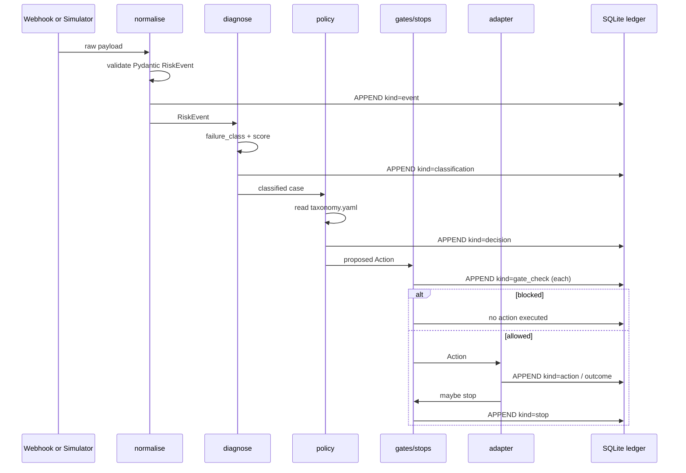

**Intern check:** After any run, you should be able to open a case and read the story **only from ledger rows**, not by guessing.

---

# PHASE 0 - Environment and repo (Day 1 morning)

## Goal
Empty folder becomes a runnable Python project with secrets pattern.

## You do

1. Create virtualenv:

```text
python -m venv .venv
.venv\Scripts\activate
pip install -r requirements.txt
```

2. Create `.env.example` (committed) and `.env` (not committed):

```text
RAZORPAY_KEY_ID=rzp_test_xxx
RAZORPAY_KEY_SECRET=xxx
RAZORPAY_WEBHOOK_SECRET=xxx
DATABASE_URL=sqlite:///./recovery.db
APP_ENV=dev
```

3. Add `.gitignore`: `.venv/`, `.env`, `__pycache__/`, `*.db`

4. `main.py` with Hello FastAPI route `GET /health` -> `{"ok": true}`

## Why this phase exists
If secrets or imports are messy on Day 1, they stay messy forever.

## Exit check
- [ ] `uvicorn` serves `/health`  
- [ ] `.env` not in git  
- [ ] Cursor can run tests later in this venv  

---

# PHASE 1 - Data layer (Day 1)

## Goal
Define **RiskEvent**, **Case**, **LedgerEntry** and persist them.

## Framework pieces
- **Pydantic** = inbound/outbound shapes  
- **SQLAlchemy** = tables  

## Teaching: two representations

| Layer | Object | Role |
|---|---|---|
| API / pipeline | Pydantic models | Validate and pass around |
| Storage | SQLAlchemy tables | Survive restarts |

Do not pass raw dicts through 6 modules. Type things.

## Tables (suggested)

```text
cases
  id, status, failure_class, score, attempts_used, contacts_used,
  stop_reason, last_action, payer_ref, amount_paise, rail, created_at, updated_at

ledger_entries
  seq (PK autoincrement), case_id, at, kind, actor,
  policy_version, payload_json, reason_code, gate_name, gate_result

processed_events
  event_id (PK), case_id, received_at
  # makes idempotency easy
```

## Flow

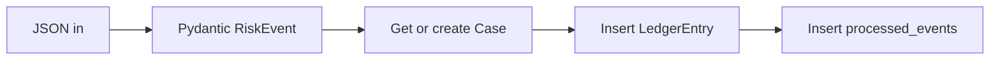

## Why SQLite
Judges do not score your managed Postgres. They score correctness and audit. SQLite file + backup is fine.

## Exit check
- [ ] Insert a fake RiskEvent in a pytest  
- [ ] Read it back as ledger rows  
- [ ] Duplicate `event_id` does not create two cases  

---

# PHASE 2 - Eval harness first (Day 1-2)  ***CRITICAL***

## Goal
**Measure before the agent is smart.** Senior insistence: build the scoreboard first.

## Why
Track 03 scores **measured money across a batch**. If you build UI first, you will invent a metric on Day 6. That looks fake.

## Modules

```text
eval/
  payer_model.py   # latent: would this payer pay if contacted at T?
  batch.py         # generate n cases from seed
  baselines.py     # B0, B1, B2 (B3 optional)
  metrics.py       # single place that computes INR stats
  harness.py       # CLI entry
```

## Deep flow

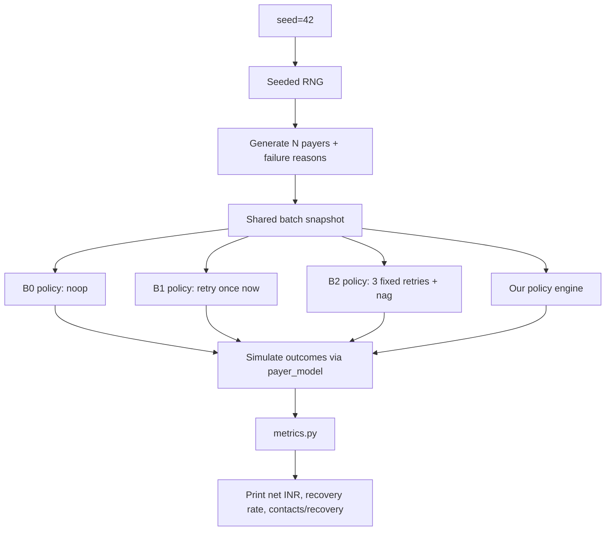

## Teaching: what the payer model is

For each simulated payer, store hidden truths:
- balance trajectory (salary clustering)  
- instrument valid?  
- response probability to a message (decays with fatigue)  

Your policy does **not** see the hidden truth directly. It only sees the failure reason + history - like production.

## Baselines (implement as plain functions)

| ID | Behavior | Code idea |
|---|---|---|
| B0 | Do nothing | return no actions |
| B1 | One immediate retry | schedule_retry now |
| B2 | 3 retries at fixed offsets + 1 generic contact | cause-blind |
| B3 | Max attempts/contacts allowed | optional |

## CLI you want

```text
python -m eval.harness --baseline b2 --seed 42 --n 500
python -m eval.harness --policy ours --seed 42 --n 500
```

## Why one metrics module
If UI computes its own totals, numbers drift. **UI only displays** what harness/API returns.

## Exit check
- [ ] Same seed => same batch => same B2 number twice  
- [ ] Methodology notes written: what fatigue curve assumes  
- [ ] You can explain B2 in one sentence to a judge  

---

# PHASE 3 - Ingest (Day 2)

## Goal
Two doors, one hallway: webhook and simulator both become `RiskEvent`.

## Files
- `ingest/webhook.py`  
- `ingest/simulator.py`  
- `ingest/normalise.py`  

## Webhook deep flow

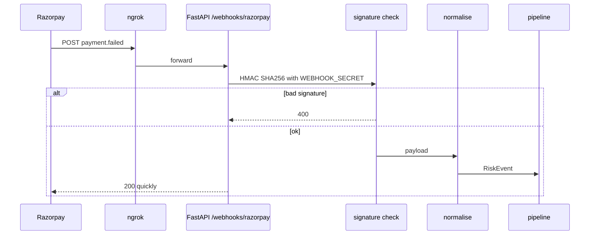

## Teaching: signature verification
Razorpay sends a signature header. You recompute hash with webhook secret. If mismatch, **reject**. Skipping this is the fastest way to look junior to a payments company.

## Normaliser responsibility
Map Razorpay fields -> RiskEvent:
- payment id -> `payment_ref`  
- error reason/code -> `raw_error_*`  
- amount, method/rail  
- invent `payer_ref` that is **not** phone/email in logs if you can avoid it  

Simulator must emit the **same** RiskEvent shape.

## Why FastAPI here
Body parsing + status codes + later OpenAPI docs for your own debugging.

## Exit check
- [ ] Fake webhook JSON through normaliser in pytest  
- [ ] One real test-mode webhook via ngrok verified  
- [ ] Simulator event uses identical schema  

---

# PHASE 4 - Taxonomy + Policy contract (Day 3)

## Goal
Encode the product idea as data + a **rules fallback**. This is the contract the AI must propose inside.

## Diagnose (rules fallback)

```text
diagnose/classifier.py
  input: raw_error_reason / code
  output: failure_class (enum)

diagnose/scoring.py
  input: class + amount + payer_context + contacts_used
  output: float score 0..1
```

### Classifier flow

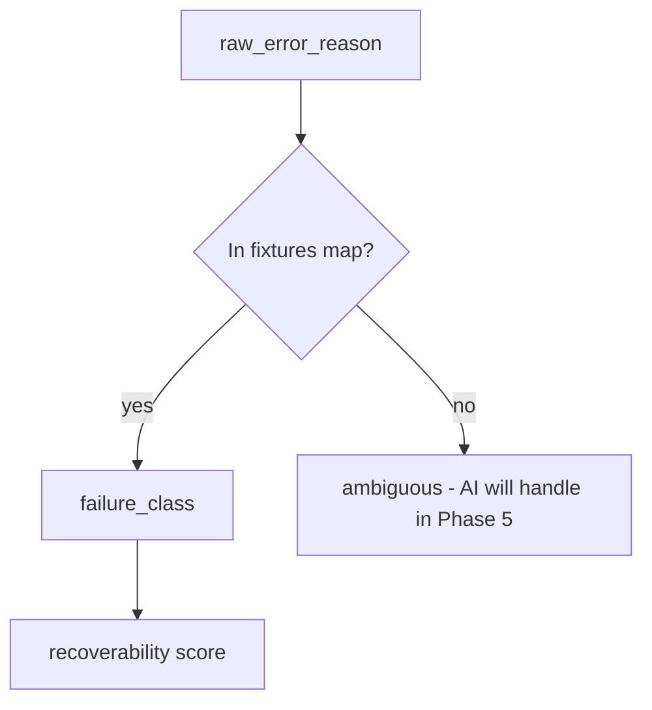

**Senior tip:** Keep a JSON fixture of Razorpay-like reasons. Document that mix is estimated.

## Policy engine = validator + fallback

```text
policy/taxonomy.yaml   # you edit by hand - product IP + AI contract
policy/engine.py       # validate AI proposal OR emit fallback Action
policy/timing.py       # salary window / backoff
```

### Action object (Pydantic) - AI must output this shape

```text
Action
  verb: schedule_retry | send_payment_link | request_mandate_update | escalate_human
  when: datetime | null
  channel: none | sms | email | link
  amount_paise: int | null
  reason_code: str
  policy_version: str
  proposed_by: llm | rules_fallback
```

## Why YAML
- Stage-readable  
- Policy version stamped on ledger  
- AI is prompted: "only propose verbs/classes from this contract"

## Exit check (Phase 4)
- [ ] Rules fallback alone can run a batch  
- [ ] Expired card => 0 retries + link in YAML  
- [ ] NSF => delayed retry in YAML  
- [ ] You are ready to wrap this with AI in Phase 5  

---

# PHASE 5 - AI Agent layer (Day 3-4)  ***REQUIRED - AI HACKATHON***

## Goal
Give AI a **significant, visible role**: it thinks, classifies messy cases, proposes the next action, and writes the message. Policy/gates still bound execution.

## Why AI is required here
This is an AI buildathon. Judges look for real agentic work - not a rules engine with a chatbot sticker. Your AI must be on the critical path of every demo case.

## Files

```text
ai/
  agent.py           # orchestrates LLM calls
  prompts.py         # system + user prompt builders
  schemas.py         # Pydantic models for structured outputs
  client.py          # OpenAI or Anthropic client wrapper
```

Add to `.env`:

```text
LLM_PROVIDER=openai
LLM_API_KEY=...
LLM_MODEL=gpt-4.1-mini
```

(Use whatever current model you have access to; one model only.)

## What the AI does on every case (significant)

| Step | Structured output | Ledger actor |
|---|---|---|
| 1. Diagnose | `{summary, likely_class, confidence, rationale}` | llm |
| 2. Propose action | `Action` JSON (closed verbs only) | llm |
| 3. Draft message | `{channel, subject, body}` if contact allowed by class | llm |
| 4. Batch summary | short paragraph after harness run | llm |

## Deep AI flow

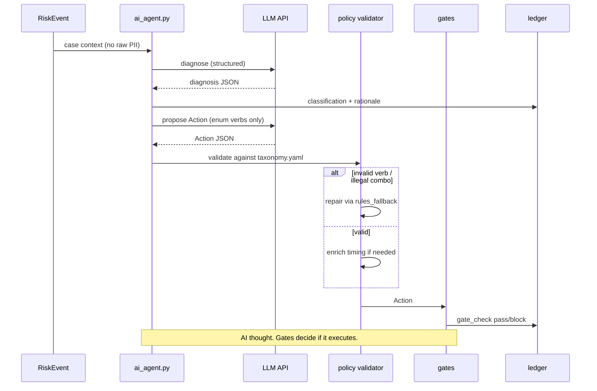

## Teaching: structured outputs
Force the model to return JSON that matches Pydantic. If parse fails:
1. Retry once with repair prompt  
2. Else `rules_fallback`  
3. Never execute free text as an action  

## Teaching: prompts without PII
Send: failure reason, rail, amount bucket, attempt #, class hints, taxonomy excerpt.  
Do **not** send phone, email, full card, raw name.

## Eval note (important for measured money)
For the **seeded batch metric**, you may run:
- `mode=ai` for demo cases / sample  
- `mode=rules` or cached AI proposals for full n=500 reproducibility  

Or: AI proposes, but timing/class caps remain deterministic so ranking stays stable. Document which mode produced the headline number.

## Ablation (Days 8-10)
Compare:
1. Fixed ladder B2  
2. Rules-only  
3. Full AI + policy + gates  

Report INR **and** qualitative wins (better ambiguous class, better messages, clearer ops narrative). AI can win the hackathon story even if INR delta is modest - say that honestly.

## Exit check
- [ ] Case view shows AI diagnosis + proposed Action JSON  
- [ ] Ledger has `actor=llm` rows  
- [ ] Invalid AI verb is rejected by policy  
- [ ] At least one contact message is AI-drafted  
- [ ] Fallback works when API key missing  

---

# PHASE 6 - Guard: gates and stops (Day 5)

## Goal
Safety is **code that can refuse**, not a slide.

## Files
- `guard/gates.py`  
- `guard/stops.py`  

## Gate pipeline

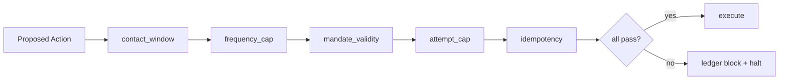

Each gate returns:

```text
GateResult(name, passed: bool, reason_code)
```

Always write a ledger row for pass **and** block (blocks are your demo gold).

## Stops

When a stop fires, case.status = stopped and **future events only log**.

| Stop | Trigger |
|---|---|
| recovered | payment success outcome |
| mandate_revoked | mandate state revoked |
| attempt_cap | attempts_used hit max |
| opt_out | flag on payer |
| human_override | manual close |

## Adversarial tests (required)

```text
tests/test_stops.py
  - close case with stop
  - fire new RiskEvent
  - assert zero execute calls

tests/test_gates.py
  - propose contact outside window
  - assert block + no adapter call
```

## Why this phase matters for AI Judgment
You are proving the system is **bounded**. Unbounded agents scare payments reviewers.

## Exit check
- [ ] pytest adversarial suite green  
- [ ] UI/API can show a blocked decision  

---

# PHASE 7 - Execute adapters (Day 4-6 overlap)

## Goal
Same interface, two backends: sim (scale) and Razorpay (truth edge).

## Interface

```text
class Executor(Protocol):
    def run(self, action: Action, case: Case) -> Outcome: ...
```

```text
Outcome
  ok: bool
  external_id: str | null   # plink_ / pay_ / sim_xxx
  raw: dict
```

## Sim adapter
- Updates simulated world clock  
- Rolls payer_model dice  
- Returns recovered / ignored / failed again  

## Razorpay adapter (test mode)

Use REST:
- Create **Payment Link** for `send_payment_link`  
- Optionally fetch payment by id for reconcile  
- Auth: Basic `key_id:key_secret`  

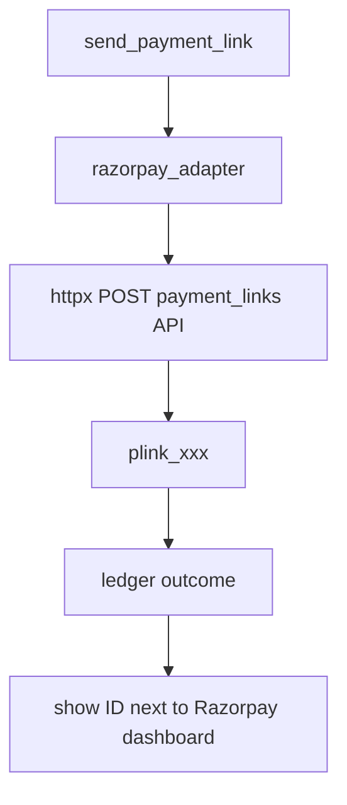

## Teaching: timeout / double charge
For `gateway_timeout` class:
1. **Fetch payment status** before retry  
2. Only then schedule retry  
3. Idempotency key on execute  

Skipping reconcile is how demos accidentally look unsafe.

## Exit check
- [x] Sim path recovers some NSF cases  
- [x] Real path creates a test Payment Link and stores id  
- [x] Adapter never called when gate blocks  

---

# PHASE 8 - API + UI (Day 5-7)

## Goal
Two screens. Large numbers. One-click case trail.

## FastAPI routes

| Method | Path | Owner |
|---|---|---|
| GET | `/health` | ops |
| POST | `/webhooks/razorpay` | ingest |
| POST | `/eval/run` | body: seed, n, policy |
| GET | `/eval/runs/{id}` | metrics JSON |
| GET | `/cases/{id}` | case + ledger |
| POST | `/demo/replay` | offline fixture replay |

## UI architecture

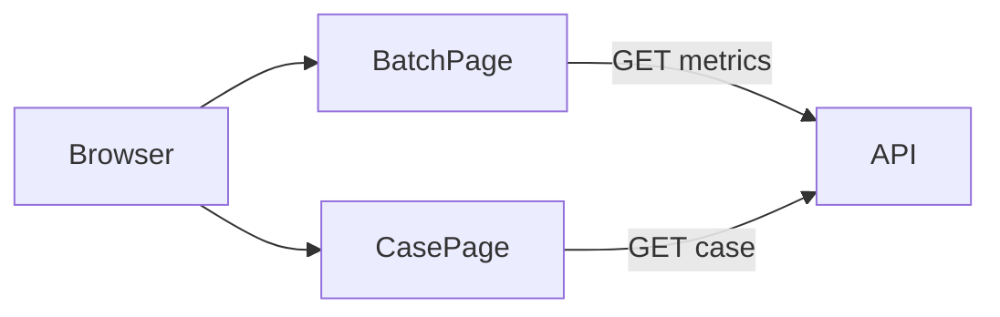

### Batch page must show
- Ours vs B2 INR  
- Recovery rate  
- Contacts per recovery  
- Gate block count  

### Case page must show
Timeline from ledger only, including:
- AI diagnosis / rationale (`actor=llm`)  
- Proposed Action JSON  
- Gate pass/block  
- Execute outcome  

## Framework choice reminder
- If React is slow for you: serve HTML templates from FastAPI. Judges prefer working over fancy.  
- If you know Vite+React: keep state minimal; fetch JSON; no Redux.

## Exit check
- [x] Batch run visible without opening DB tools  
- [x] AI reasoning visible on case page  
- [x] Case refusal visible as a gate_check block row  

---

# PHASE 9 - Hardening + submission tech (Day 8-13)

## Checklist
- [x] README: how to install, set env, run harness, run API  
- [x] `docs/ARCHITECTURE.md` - paste pipeline diagram  
- [x] `docs/METHODOLOGY.md` - assumptions, seeds, baselines  
- [x] `docs/COMPLIANCE.md` - gates/stops list  
- [x] Backup demo video + `/demo/replay` fixture  
- [x] No secrets in git (`gitleaks` mental check)  

## Logging
Use structured logs: `case_id`, `event_id`, `verb`, `gate`.  
Never log full webhook PII blobs.  
Implemented: `logging_util.slog` + webhook/eval/execute hooks; `scripts/check_no_secrets.py`.

---

# 4. End-to-end runtime map (put on a wall)

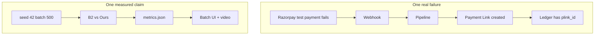

Your submission needs **both** subgraphs.

---

# 5. Suggested build order inside each coding day

1. Write/adjust a test or harness assertion  
2. Implement the smallest function  
3. Run harness / pytest  
4. Only then wire API/UI  

This is TDD-lite. It keeps Cursor from generating beautiful dead code.

---

# 6. Common intern mistakes (I will stop you)

| Mistake | What I say |
|---|---|
| Skip AI because "rules are enough" | No - this is an AI hackathon; AI must be on the critical path |
| Unbounded agent with no closed verbs | No - AI proposes inside the Action schema only |
| Start Day 1 with prompt tuning | No - scoreboard + taxonomy contract first, then AI |
| Put taxonomy in scattered ifs | Put it in YAML. |
| Compute metrics in React | Metrics in `eval/metrics.py` only. |
| Skip webhook signature | Fix today. |
| Add voice on Day 4 | Cut. |
| "I'll document later" | Methodology on Day 1-2. |
| Two different event shapes | One RiskEvent forever. |
| Hide AI failure modes | Show gate block of a bad AI proposal - that is a feature |

---

# 7. Phase exit summary card

| Phase | You can say this out loud |
|---|---|
| 0 | App boots; secrets safe |
| 1 | Events persist; idempotent |
| 2 | I can measure INR on a seeded batch |
| 3 | Webhook and sim look identical |
| 4 | Taxonomy contract + rules fallback exist |
| 5 | AI diagnoses, proposes, and drafts messages on the critical path |
| 6 | System can refuse AI proposals and stop |
| 7 | Sim scale + real Payment Link edge |
| 8 | Demo UI shows AI + money metrics |
| 9 | Stranger can run from README |

---

# 8. Your next concrete step

Open a terminal in `Rz`, create `recovery-agent/`, and complete **Phase 0 + Phase 1** only:
1. venv + FastAPI `/health`  
2. Pydantic `RiskEvent`  
3. SQLite ledger write/read test  

Then Phase 2 harness, Phase 3 ingest, Phase 4 taxonomy, **Phase 5 AI agent (required)**.  
Do not ship without visible AI reasoning on the case trail.

---

*Senior note: For an AI hackathon, the model must do real work. For a payments audience, that work must be bounded. AI proposes; policy/gates dispose. That combination is the product.*
