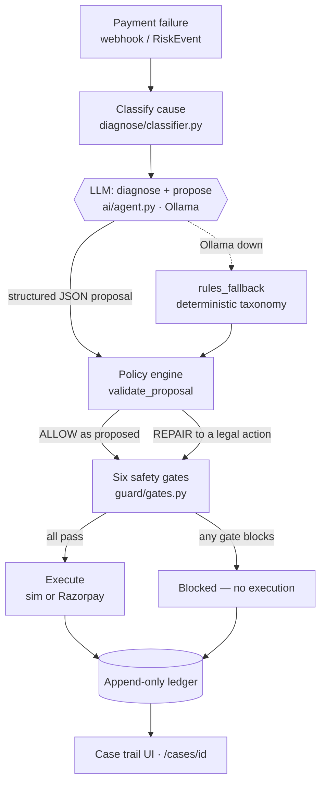

# AI Revenue Recovery Agent

[](https://github.com/reet1512/razorpay-buildathon-application-ai-revenue/actions/workflows/ci.yml)

**Razorpay /buildathon — Track 03.** AI-driven diagnosis of failed subscription
payments, with deterministic financial safety controls that decide what is allowed
to execute.

> ## AI proposes. Policy disposes.
>
> Failed payments are not interchangeable. Retrying an insufficient-funds decline
> at the right moment often recovers the money. Retrying an expired card cannot
> succeed at all, and retrying a suspected-fraud case is a compliance problem
> rather than an optimisation.
>
> An LLM interprets *why* a payment failed and proposes a recovery action. A
> deterministic policy engine and a set of safety gates decide whether that action
> may reach execution. Every decision lands in an append-only ledger.
>
> **The LLM can propose. It cannot authorise money movement.**

**New here?** Read §1–§7 for the thesis and the numbers (about four minutes), or
jump to [Run it](#run-it) / [docs/SETUP.md](recovery-agent/docs/SETUP.md).

**One thing to know before the numbers:** this repository contains **two separate
evaluation tracks**, and they measure different things. The headline rupee figure
comes from the *deterministic policy*, not from the LLM. §6 explains exactly why,
and we are careful never to blur the two.

---

## 1. The problem

A subscription payment fails. Most dunning systems answer with the same fixed
retry ladder no matter what went wrong, because the failure reason is treated as
noise rather than signal.

The reasons are not equivalent:

| Failure | Can a retry work? |
|---|---|
| Insufficient funds | Yes — but mostly only after money arrives |
| Issuer transient / gateway timeout | Often, quickly |
| Expired card, invalid token, revoked mandate | No. The instrument is dead |
| Suspected fraud / risk | Should not be retried automatically at all |
| `do_not_honour` and similar catch-alls | Genuinely ambiguous |

Cause-blind recovery is expensive in both directions at once. It burns gateway
fees on attempts that are arithmetically incapable of succeeding, and it mistimes
the attempts that could have worked. Beyond the direct fee, repeated retries erode
issuer trust, repeated messaging drives churn, an uncertain outcome after a
timeout risks charging a customer twice, and contacting a flagged account is a
compliance exposure rather than a lost opportunity.

We do not publish an industry recovery-rate baseline here, because we have no
authoritative merchant data to cite and inventing one would undercut everything
else on this page.

## 2. Our insight

> **Not every failed payment should be retried, and the ones that should are not
> all due for a retry right now.**

A recovery system therefore has to sort failures into meaningfully different
buckets — retryable now, retryable later, permanently dead instrument, prohibited,
and ambiguous — and then act differently in each.

That classification is a judgement call over messy, inconsistent, sometimes
free-text issuer data. It is exactly the kind of work a language model is good at
and deterministic rules are bad at.

Money movement is the opposite. It needs to be predictable, auditable, and
identical on every run. It is exactly the kind of work deterministic code is good
at and a language model should not be trusted with.

So we split them:

- **AI handles interpretation** — reading the failure, diagnosing the cause,
  proposing an action.
- **Deterministic policy handles authority** — validating or rewriting that
  proposal, then allowing or blocking it at the gates.

This is not a safety disclaimer bolted onto an LLM feature. It is the architecture.

## 3. How it works



| Stage | What it does | Where |
|---|---|---|
| **Classify** | Maps a raw decline reason or code to a failure class | `diagnose/classifier.py` |
| **LLM diagnose + propose** | Reads the case, explains the likely cause, proposes one action from a closed verb set | `ai/agent.py` |
| **Policy engine** | Validates the proposal against the taxonomy for that class; **rewrites it** if illegal | `policy/engine.py` · `policy/taxonomy.yaml` |
| **Safety gates** | Six independent checks; each can **block** | `guard/gates.py` |
| **Execute** | Simulated executor by default; Razorpay Payment Links at the edge | `execute/` |
| **Ledger** | Append-only record of every gate verdict and action | `ledger/` |

**A precision point, because it matters for reviewing the code:** repair and
blocking happen at *different* layers. `validate_proposal` rewrites an illegal
proposal into a legal one. The six gates do not rewrite anything — they return
allow or block. We keep these distinct rather than describing one fuzzy
"ALLOW/REPAIR/BLOCK" stage, because that is how the code is actually built.

## 4. The safety model

Six gates run on every action. All six always execute so the audit trail is
complete, and the action proceeds only if **all** of them pass; the reported
`blocked_by` is the first gate to fail in order.

| # | Gate | Blocks when | The failure it prevents |
|---|---|---|---|
| 1 | `prohibited_recovery` | Failure class is `risk_fraud` and the action moves money or contacts the payer | Automated dunning against a flagged account |
| 2 | `contact_window` | A contact action falls outside 09:00–21:00 IST | Messaging a customer at 3 a.m. |
| 3 | `frequency_cap` | Contacts already used ≥ cap (default 2) | Dunning spam and the churn it causes |
| 4 | `mandate_validity` | A money action targets a `revoked` or `expired` mandate | Debiting against a dead mandate |
| 5 | `attempt_cap` | Attempts used ≥ cap (default 3) | Endless retries and issuer-trust decay |
| 6 | `idempotency` | This exact action fingerprint already executed for this case | Double charge / duplicate message |

Every gate verdict — pass *and* block — is written to the ledger as a
`gate_check` row, so a blocked case is as auditable as an executed one. A blocked
action produces no `action` row at all, because it never ran.

**Idempotency is rebuilt from the ledger**, not held in memory: on each request the
pipeline replays the `action` rows for that case to reconstruct which fingerprints
have already executed. That is what makes it survive a process restart. It is
still *check-then-act*, so two genuinely concurrent requests remain a theoretical
race — see [LIMITATIONS.md](recovery-agent/docs/LIMITATIONS.md) §4.1.

### Reconciliation before retry

For an uncertain outcome such as a gateway timeout, retrying blind is how systems
double-charge people. The Razorpay executor checks first:

```text
Timeout, payment_ref known
        ↓
GET /payments/{id}
        ↓
Already captured / authorized / paid?
   ├── YES → reconciled_skip, no retry
   └── NO  → eligible for retry
```

**Scope, stated plainly:** this runs in `execute/razorpay_adapter.py` on the live
Razorpay `schedule_retry` path, and only when a `payment_ref` exists and dry-run
is off. The simulated executor — which is the default mode, and the one the batch
evaluation uses — does **not** reconcile, because there is no gateway to ask. So
this is a real safeguard on the real-money path, not a property of every number in
this repo. We would rather say that than let the diagram imply blanket
double-charge immunity.

### What the gates do *not* cover

Three honest gaps, because a safety section that only lists wins is not a safety
section:

- **`prohibited_recovery` is inert on the generic `POST /execute/run` endpoint**,
  which never populates `failure_class` on the guard context. The gate fires in the
  fraud demo path, which sets it explicitly. Wiring classification through to the
  execute endpoint is a known gap, not a claim we are making.
- **Card-network retry caps are counted, never enforced.** `scheme_cap_breaches`
  is computed in the evaluation economics, but no gate blocks on it, and with
  current policies the counter is always 0. Details in
  [LIMITATIONS.md](recovery-agent/docs/LIMITATIONS.md) §4.4.
- **No API authentication.** Every endpoint, including mutating ones, is open.
  Deliberate for a hackathon; disqualifying for production.

## 5. Why AI is used

We are deliberately not claiming *"AI decides whether to retry."* It does not.

> The LLM is used where deterministic rules are weakest: **interpreting the
> failure and proposing an action.** The deterministic policy layer remains the
> authority over what executes.

Concretely, `ai/agent.py` makes up to three bounded LLM calls per case:

| Call | Output | How it is constrained |
|---|---|---|
| **Diagnose** | `summary`, `likely_class`, `confidence`, `rationale` | Pydantic-validated; `likely_class` clamped to taxonomy keys, else falls back to the rules classifier |
| **Propose** | One `Action`: verb, day offset, channel, reason code | `verb` is a **closed enum** — an unknown verb fails parsing outright |
| **Draft message** | Customer-facing subject and body | Contact verbs only; on failure a canned template is used and **the action is unchanged** |

Then `policy/engine.py::validate_proposal` gets the final word on legality. A
proposal is not accepted or refused — it is **repaired into the nearest legal
action**:

- Class is `stop` (fraud) → verb becomes `escalate_human`
- Class is `dead` and the LLM said `schedule_retry` → becomes the class default,
  e.g. `send_payment_link`, tagged `validator_blocked_retry_on_dead`
- Class forbids contact but the LLM proposed contact → becomes `schedule_retry`,
  or `escalate_human` if no retries remain, tagged `validator_blocked_contact`

**If Ollama is unavailable, nothing breaks.** The agent returns a deterministic
taxonomy-derived action stamped `proposed_by: rules_fallback`, and the UI badge
reads "Offline" rather than pretending. Retrieval over past recovery episodes
(via Inherent) is injected into the prompts as *evidence only* — it never bypasses
the validator or the gates, and it is off by default.

## 6. Evaluation: two tracks, deliberately separate

This is the section we would most want a reviewer to read carefully.

### Track A — Policy evaluation (implemented, and the source of every rupee figure)

A seeded simulator generates a batch of failed payments and scores two policies
against the **same** cases:

- **Ours** — cause-aware, driven by `policy/taxonomy.yaml`
- **B2 baseline** — three fixed retries plus one generic nag, for every failure
  reason regardless of cause

Scoring is **net INR**, not gross recovery, so a policy cannot win by spending
₹100 of fees to recover ₹100. Fully reproducible from seed.

> ### The headline batch benchmark does not use the LLM.
>
> No module under `eval/` imports the LLM, the Ollama client, or the RAG layer.
> The batch path runs `policy_ours_from_taxonomy` → `engine.decide()`, which is
> pure deterministic rules.

This is a design decision, not an oversight. Making an n=500 benchmark depend on a
local 8B model would make the result unreproducible from run to run, tie the
headline number to sampling temperature, break the demo whenever Ollama is slow,
and — most importantly — measure *model variance* rather than *policy quality*.
The benchmark is designed to isolate the recovery policy so that policy
comparisons stay auditable.

The cost of that choice is real and we absorb it rather than hide it: **we cannot
express the LLM's contribution in rupees, and we do not try.**

### Track B — AI evaluation (not built)

> The large-scale benchmark intentionally isolates policy performance. Measuring
> the LLM's incremental value on ambiguous failure classification is a **separate
> evaluation track and remains future work** — it is a current limitation of this
> submission, not a result we are withholding.

There is no LLM accuracy number in this repository. No confusion matrix, no
labelled set of ambiguous free-text declines, no LLM-versus-rules comparison. The
existing AI tests verify plumbing — structured output, taxonomy clamping, graceful
fallback — not judgement quality.

The experiment we would run is specified in
[LIMITATIONS.md](recovery-agent/docs/LIMITATIONS.md) §3.4, and it starts with
`do_not_honour`: the ambiguous class where our deterministic policy currently
*loses* to the baseline, and therefore the one place the LLM has the clearest
opportunity to earn its place.

So, stated once and consistently for the rest of this document:

| | Claim | Status |
|---|---|---|
| **Policy improvement** | Measured in the deterministic evaluation, seed 42 | Quantified below |
| **AI contribution** | Diagnosis and proposal on ambiguous cases, bounded by policy | **Architectural, not yet quantified** |

## 7. Results

**Every number in this section is a simulation output, not a production
measurement.** Seed 42, n=500, identical cases for both policies.

| | Ours | B2 baseline | Δ |
|---|---:|---:|---:|
| **Net recovered** | ₹489,604 | ₹382,467 | **+₹107,137** |
| Gross recovered | ₹499,628 | ₹399,796 | +₹99,832 |
| Recovery rate | 74.7% | 59.8% | +14.9 pts |
| Retry attempts | 558 | 959 | −401 |
| Payer contacts | 265 | 386 | −121 |
| Cost of recovery | ₹10,024 | ₹17,329 | −₹7,305 |
| Cost per ₹ recovered | ₹0.020 | ₹0.043 | −53% |

At n=1000 the same seed gives 75.5% vs 59.6% and +₹220,426.

Reproduce it exactly:

```bash
python -m eval.harness --benchmark --seed 42 --n 500
```

### Where the advantage actually comes from

Aggregate numbers hide the interesting part. By recovery class at n=500:

| Class | Ours | B2 | Reading |
|---|---:|---:|---|
| `RETRY_FIXABLE` | **89.8%** | 65.7% | Cause-aware retry timing works here |
| `CUSTOMER_ACTION` | **75.7%** | 65.1% | Link beats retrying a dead instrument |
| `AMBIGUOUS` | 29.5% | **39.3%** | **We lose.** Baseline brute force beats us |
| `PROHIBITED` | 4.5% | **31.8%** | B2 "wins" by retrying fraud — we refuse, by design |

Two of those rows are not wins, and both are informative. On `AMBIGUOUS` we are
genuinely beaten. On `PROHIBITED` the baseline recovers more money precisely
because it does something a payment system should not do; that money is a
compliance liability, not a product win.

### How to read the headline honestly

Three caveats that materially change interpretation:

1. **The advantage is highly concentrated.** About **99%** of the gross edge comes
   from one failure reason, `insufficient_funds` (+₹98,732 of +₹99,832).
2. **That concentration is partly circular.** Our retry timing fans across days
   1–7, and the simulator draws the payer's hidden payday from days 1–7. The
   policy is searching exactly where the simulator hid the answer.
3. **We lose on four of eight failure reasons**, together −₹20,084.

Which is why the number to trust here is the *ranking under stated assumptions*,
not the rupee magnitude. The full per-reason table, the specific lines of code
that overlap, and what we would change is in
**[docs/LIMITATIONS.md](recovery-agent/docs/LIMITATIONS.md)** — the most useful
file in this repo for judging whether the engineering is honest.

## 8. Economics

The scoreboard is **net**, because gross recovery is easy to game by spending
more than you retrieve. `eval/costing.py` prices:

| Component | What it captures |
|---|---|
| MDR / success fee | Percentage cost on money actually recovered |
| Failed-attempt fee | PSP cost per failed retry |
| Messaging cost | Per outbound contact |
| Churn cost | Expected LTV loss from inappropriate contact |
| Issuer-trust decay | Modelled penalty for excess attempts |
| **Forgone recovery** | Money the system **chose not to pursue** |

That last line is the one we would point a reviewer at. When the fraud gate blocks
a recovery attempt, the money that might have come back is recorded as
`forgone_recovery_inr` rather than quietly omitted.

> A safety-first system should be willing to price the revenue it declines to
> chase. Otherwise "we blocked it" is an unfalsifiable virtue, and the
> `PROHIBITED` row above would look like a bug instead of a decision.

**These are simulated costs.** Of 13 priced parameters in `config/costs.json`,
**11 are marked `ASSUMPTION`**; only the MDR percentage is `published` and only the
failed-attempt fee comes from a dashboard. Net INR is therefore model-dependent.
The cost model is deliberately transparent and swappable — that is why it is a
config file — but it has not been audited, and no figure here is production
revenue.

## 9. Robustness and sensitivity

What we did vary: batch size (n=200/500/1000 at seed 42), with the advantage
holding in direction and scaling with n.

What we did **not** vary — the honest list, since each of these could move the
result:

| Dimension | Status | Why it matters |
|---|---|---|
| **Classifier accuracy** | **Not tested** | The batch assumes a perfect oracle. Our whole edge comes from knowing the cause |
| **Payday distribution** | Not tested | Days 1–7 is also where our policy looks (§7). The obvious confound |
| **Contact fatigue** | Not tested | A single 0.55 multiplier drives much of the contacts story |
| **Dead-instrument recovery** | Hard-coded zero | Real account-updater services do silently refresh some cards |
| **Multiple seeds** | **Not run** | Everything published is seed 42. The harness supports `--seeds 42-51`; we never published the sweep |
| **Decline mix** | Not tested | Estimated from public commentary, not Razorpay data |

The classifier-noise experiment is fully specified — corrupt the observed failure
reason at 0/5/10/15/20/30% using plausible confusion pairs such as
NSF ↔ `do_not_honour`, keep ground truth intact, and use the cause-blind baseline
as an invariant control — and it is **not implemented**. We are stating the design
rather than the result, because we do not have the result.

Single-seed reporting is the weakness we would fix first if we had another day.

## 10. What we deliberately do not claim

- **We do not claim simulated recovery equals production recovery.** Every rupee
  and percentage here is a simulator output under assumptions we chose.
- **We do not claim the LLM produced the headline number.** It did not; the batch
  is deterministic rules, by design (§6).
- **We do not claim a measured AI improvement.** No LLM accuracy evaluation
  exists in this repo.
- **We do not claim our recovery rates are industry benchmarks.** 74.7% is a
  property of our payer-model priors, and real dunning performance is generally
  reported far lower.
- **We do not claim perfect classification is available in production.** Issuer
  codes are unreliable and `do_not_honour` hides several distinct causes.
- **We do not claim RBI or e-mandate compliance.** No pre-debit notification, AFA,
  or e-mandate lifecycle logic exists in this codebase. `mandate_validity` is a
  simplified revoked/expired check, and calling it regulatory compliance would be
  false.
- **We do not claim card-network retry-cap enforcement.** It is measured, not
  enforced.
- **We do not claim production readiness.** No auth, no migrations, SQLite,
  check-then-act idempotency, no tracing.
- **We do not claim independent real-world validation.** We have none.

We know precisely what we have demonstrated and precisely what remains to be
validated. The architecture is the contribution; the rupee figures rank two
policies inside our own simulator.

## 11. Demo flow

A 60–90 second path, using only what actually works:

1. **Start clean** — `uvicorn main:app --reload --port 8000`, open `/ui`.
2. **Run the evaluation** — seed 42, n=500. The Stats screen is empty until you
   do; it renders only measured values.
3. **Watch one case reason** — `/ui/recover`. Diagnosis, then a proposed action,
   with `proposed_by` showing `llm` or `rules_fallback` truthfully.
4. **See a repair** — an LLM proposing a retry on `card_expired` gets rewritten to
   `send_payment_link`.
5. **See a block** — the fraud demo, where `prohibited_recovery` stops the action
   *before* execution.
6. **Open the ledger trail** — `/cases/{id}`, showing all six gate verdicts and
   the outcome, from the database.
7. **Prove idempotency** — `POST /execute/run` twice with the same operation. The
   second returns `blocked_by: idempotency`, rebuilt from the ledger.
8. **Prove fail-closed webhooks** — `POST /webhooks/razorpay` unsigned returns
   401.

Step 8 is the one worth trying to break. Commands for all of these are in
[docs/SETUP.md](recovery-agent/docs/SETUP.md).

## 12. Worked examples

**Dead instrument — the policy overrules the model.**

```text
Failure          card_expired
Classified       CUSTOMER_ACTION  (category: dead)
LLM diagnosis    "Payment instrument has expired"
LLM proposal     schedule_retry           ← plausible, and wrong
Taxonomy         max_retries: 0, default_verb: send_payment_link
Policy           REPAIR → send_payment_link
                 note: validator_blocked_retry_on_dead
Gates            all six pass
Execute          payment link issued
Ledger           proposal, repair, 6 gate verdicts, action
```

The LLM was not punished for being wrong; it was *corrected*. This is
`tests/test_policy_phase4.py`, not a story.

**Uncertain outcome — check before acting.**

```text
Failure          gateway_timeout
Classified       RETRY_FIXABLE  (category: transient)
Taxonomy         max_retries: 2, reason_code: TIMEOUT_RECONCILE_RETRY
Razorpay path    GET /payments/{ref}
                 captured/authorized → reconciled_skip, no retry
                 otherwise           → retry day 0, then day 1
```

**Prohibited — refusing revenue on purpose.**

```text
Failure          risk_fraud
Classified       PROHIBITED  (category: stop)
LLM proposal     send_payment_link
Policy           REPAIR → escalate_human
Gate 1           BLOCK (prohibited_recovery)
Execute          never reached
Economics        recorded as forgone_recovery_inr
```

## 13. Run it

**Python 3.12+ and one `pip install` is the whole requirement.** No Docker, no
LLM, no Razorpay account, no model download. Ollama and Inherent are optional
add-ons — tiered instructions in
**[docs/SETUP.md](recovery-agent/docs/SETUP.md)**.

```bash
git clone https://github.com/reet1512/razorpay-buildathon-application-ai-revenue.git
cd razorpay-buildathon-application-ai-revenue/recovery-agent

python -m venv .venv
source .venv/bin/activate        # Windows: .venv\Scripts\Activate.ps1
pip install -r requirements.txt
cp .env.example .env             # Windows: copy .env.example .env

pytest -q                        # 154 tests, no external services needed
python -m eval.harness --benchmark --seed 42 --n 500
uvicorn main:app --reload --port 8000
```

Then open http://127.0.0.1:8000/ui and click **Run evaluation** (seed 42, n=500).

> **The Stats screen is empty until you do this.** Deliberate — the UI will not
> render a rupee figure it did not compute — but it looks like a bug if you are
> not expecting it.

| URL | Shows |
|---|---|
| `/ui` | Stats: Ours vs B2 in net INR, from the stored run |
| `/ui/recover` | The agent reasoning over a single case |
| `/cases/{id}` | Real append-only ledger trail |
| `/docs` | OpenAPI |

### Optional add-ons

| Add-on | Gives you | Without it |
|---|---|---|
| **Ollama** | Live LLM diagnosis and drafting | `rules_fallback`; badge reads "Offline" |
| **Inherent** (separate Docker stack, not vendored here) | RAG evidence in prompts | Badge reads "RAG DISABLED" |
| **Razorpay test keys** | Real Payment Links + reconciliation | Sim executor; placeholder keys force dry-run |

Neither affects the benchmark or the tests — the batch path is deterministic
either way.

## 14. Technical architecture

FastAPI + Pydantic, SQLAlchemy over SQLite, Jinja2 templates for the UI, `httpx`
for outbound calls. The taxonomy is YAML and the cost model is JSON, so the
domain rules are reviewable without reading Python. Ollama (local LLM) and
Inherent (semantic memory) are reached over plain HTTP and are both optional —
there is no vendor SDK and no ML dependency in `requirements.txt`.

## 15. Guided tour of the code

The fastest way to review the actual thesis, in reading order:

| # | File | Why it matters |
|---|---|---|
| 1 | [`policy/taxonomy.yaml`](recovery-agent/policy/taxonomy.yaml) | The domain model. Per-cause verbs, retry caps, timing, contact rules |
| 2 | [`policy/engine.py`](recovery-agent/policy/engine.py) | `validate_proposal` — where an illegal LLM action is repaired |
| 3 | [`guard/gates.py`](recovery-agent/guard/gates.py) | The six gates. Allow or block, never rewrite |
| 4 | [`guard/pipeline.py`](recovery-agent/guard/pipeline.py) | Gate → execute → ledger, with idempotency replayed from the ledger |
| 5 | [`ai/agent.py`](recovery-agent/ai/agent.py) | The three bounded LLM calls, and the fallback path |
| 6 | [`execute/reconcile.py`](recovery-agent/execute/reconcile.py) | Check payment status before retrying — Razorpay path |
| 7 | [`ingest/verify.py`](recovery-agent/ingest/verify.py) | Webhook HMAC, fail-closed by default |
| 8 | [`eval/payer_model.py`](recovery-agent/eval/payer_model.py) | The hidden simulator truth — and the assumptions LIMITATIONS.md attacks |
| 9 | [`eval/costing.py`](recovery-agent/eval/costing.py) | Why the headline is *net* INR |

## 16. Limitations

The short version: the architecture is the contribution, the rupee figures are a
ranking under stated assumptions, the advantage is concentrated in one failure
reason that our simulator and our policy agree about, the classifier is a perfect
oracle in the batch, there is no measured AI claim, and nothing here is
production-hardened.

Full treatment, with code citations:
**[docs/LIMITATIONS.md](recovery-agent/docs/LIMITATIONS.md)**.

## 17. Future work

In the order we would actually do it — the first two change what we are *allowed
to claim*, which makes them worth more than any feature:

1. **Widen the simulator's payday distribution** so our days 1–7 fan-out is no
   longer a perfect cover, and report how much edge survives.
2. **Run the classifier-noise sweep** (0–30%), converting our weakest claim into a
   measured one.
3. **Build the ambiguous free-text dataset** and measure LLM vs rules, starting
   with `do_not_honour` — the class we currently lose.
4. **Publish a multi-seed sweep** (42–51) instead of a single seed.
5. **Replace the dead-instrument hard zero** with an account-updater probability.
6. **Close the idempotency race** with a unique constraint on
   `(case_id, fingerprint)` and `IntegrityError` handling.
7. **Enforce, rather than count, retry caps** — wire `max_attempts_hard_decline`
   into a real gate.
8. **Wire `failure_class` through `/execute/run`** so the fraud gate is live on
   the generic path, not only the demo.
9. **Production hardening:** API authentication, migrations, Postgres, tracing.

## Documentation

| Doc | Contents |
|---|---|
| [SETUP.md](recovery-agent/docs/SETUP.md) | **Running it.** Tier 0 (nothing) → Ollama → Inherent, plus troubleshooting |
| [LIMITATIONS.md](recovery-agent/docs/LIMITATIONS.md) | **What this project does not prove.** Start here |
| [ARCHITECTURE.md](recovery-agent/docs/ARCHITECTURE.md) | Pipeline diagrams and package map |
| [METHODOLOGY.md](recovery-agent/docs/METHODOLOGY.md) | Seeds, payer model, baselines, scoring |
| [COMPLIANCE.md](recovery-agent/docs/COMPLIANCE.md) | Gates, stops, webhook verification, PII rules |
| [SCORING.md](recovery-agent/docs/SCORING.md) | How net INR is computed and why |
| [WHAT_BROKE.md](recovery-agent/docs/WHAT_BROKE.md) | Build failures and what they taught us |
| [DEMO.md](recovery-agent/docs/DEMO.md) | Walkthrough script |

## Repo layout

| Path | Contents |
|---|---|
| `recovery-agent/` | The application: API, AI, eval, gates, ledger, UI |
| `recovery-agent/docs/` | Architecture, methodology, limitations, compliance |
| `.github/workflows/ci.yml` | Lint, tests, secret scan, benchmark reproducibility |
| `BUILD_PLAN.md` · `BUILD_TECH.md` | Historical planning documents, kept for provenance |

**Never commit `.env`.** Test-mode Razorpay keys only; `scripts/check_no_secrets.py`
runs in CI to enforce it.
