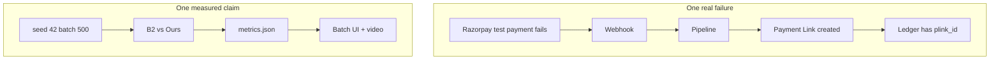
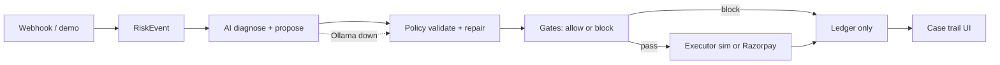
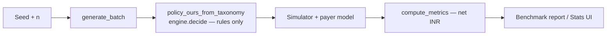

# Architecture — Recovery Agent

Razorpay /buildathon Track 03 · AI Revenue Recovery.

## One-line design

**AI proposes → policy/gates dispose → ledger records → sim measures at scale, Razorpay proves at the edge.**

> **Read the two paths separately.** The *product path* below runs the LLM on a
> single case. The *batch path* runs the deterministic taxonomy policy over n=500
> and produces every rupee figure we publish — **it does not invoke the LLM at
> all.** That split is deliberate (reproducibility) and is the single most
> important thing to understand before reading any number in this repo.
> See [LIMITATIONS.md](LIMITATIONS.md) §3.1.

## End-to-end map



Submission needs **both** subgraphs.

## Pipeline (product path — LLM active)



Note that *repair* happens at `validate_proposal`, not at the gates — the gates
only allow or block. The dotted edge is the `rules_fallback` path.

## Pipeline (batch path — no LLM)



This is the path behind `--benchmark --seed 42 --n 500`. No module under `eval/`
imports the LLM, the Ollama client, or the RAG layer.

## Truth model (three layers)

| Layer | Object | Who may read it |
|---|---|---|
| Observed | `RiskEvent` / `VisibleCase` | Agent, policy, UI |
| Decision / audit | `ledger_entries` | Ops, judges, demos |
| Hidden sim | `HiddenPayerTruth` | Eval simulator **only** |

Policies that peek at hidden truth cheat the metric.

## Package map

| Path | Role |
|---|---|
| `ledger/` | Persist cases + append-only audit |
| `ingest/` | Signature verify + normalise → `RiskEvent` |
| `diagnose/` + `policy/` | Taxonomy, scoring, rules fallback / validator |
| `ai/` | Ollama `qwen3:8b` diagnose / propose / message |
| `guard/` | Gates + stops (can refuse AI) |
| `execute/` | Sim adapter + Razorpay Payment Links |
| `eval/` | Seeded batch, baselines, metrics (INR) |
| `demo/` | Offline fixture replay for video backup |
| `api/` + `templates/` | HTTP + Batch/Case UI |

## Closed Action verbs

```text
schedule_retry | send_payment_link | request_mandate_update | escalate_human
```

The LLM cannot invent channels or verbs outside this set. `PolicyEngine.validate_proposal` is the hard bound.

## Dual execution

| Mode | Use |
|---|---|
| `sim` | n=500 scoreboard, CI, reproducible INR |
| `razorpay` | Test-mode Payment Link; store `plink_…` in ledger |

Never call an adapter when a gate blocks (`execute/service.py` → `guard_and_maybe_execute`).

## Key HTTP surface

| Method | Path | Purpose |
|---|---|---|
| GET | `/health` | Ops |
| POST | `/webhooks/razorpay` | Signed ingest |
| POST | `/agent/run` | Live AI path |
| POST | `/guard/check` | Gate refusal demo |
| POST | `/execute/run` | Guard + adapter |
| POST | `/eval/run` | Batch metrics |
| GET | `/cases/{id}` | Case + ledger JSON |
| POST | `/demo/replay` | Offline trail |
| GET | `/ui/batch` | Scoreboard screen |
| GET | `/ui/cases/{id}` | Timeline screen |

See also: [COMPLIANCE.md](COMPLIANCE.md), [METHODOLOGY.md](METHODOLOGY.md).
